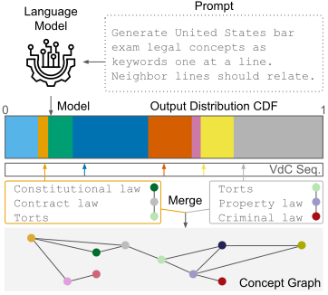

# DecompressionLM

Zero-shot concept graph extraction from LLMs using deterministic arithmetic sampling,  
to discover what language models encode in the form of concept graphs [](https://arxiv.org/abs/2602.00377)

<p align="center">
  
</p>

<div style="width:64%; margin: 0 auto; text-align: left;">
  <b>Figure:</b> Diagram of the DecompressionLM pipeline. Given a domain-specific prompt, the language model generates tokens sampled from its output distribution. Multiple parallel sequences yield diverse outputs from which we extract legal concepts (e.g., “Constitutional law”, “Torts”). Concepts are normalized and then merged across sequences to construct a concept graph for analysis.
</div>

## Test Your Model

### How to
```python
prompt = """Generate United States bar exam legal concepts as keywords.

Please output ONE concept per line.
Each concept can be multiple words if needed.
Do not include explanations or extra text.
Please begin from any random concept.
Please use English.
"""

results = estimate_prefix_mass(
    model=model,  # by default, you can load the model in torch.bfloat16
    tokenizer=tokenizer,
    prefix=prompt,
    prefix_len=16,  # please leave this as-is; it is not used since it is disabled by prob_threshold=1.0
    max_len=16,
    max_samples=8192,
    prob_threshold=1.0,  # disabled, as it is not used in this paper
    use_chat_template=True,
    batch_size=256,
    display_interval=256,  # please set this to batch_size or a multiple of it if sampling is fast
    save_path=(
        "results/api_call_example/"
        "Qwen2.5-7B-Instruct__BF16_BASE__us_law_bar_meta__L16__T1.0.delm.parquet"
    ),
    model_name="Qwen2.5-7B-Instruct__BF16_BASE",  # used for logging only; set as you see fit
    enable_graph_analysis=True,
)
````

Please keep in mind that, because of our custom implementation of sampling, some models with different KV cache specifications might not work out of the box and may throw confusing errors. In the worst case, you might need to modify the code in `src/arithmetic.py` around line 96, where the variable `is_gemma` can be used to disable the KV cache when set to `True`. This overrides KV cache issues but may be slower.

### What you will get

<details>
  <summary><b>Example</b></summary>
  <pre>================================================================================
GRAPH ANALYSIS
================================================================================

Concept Extraction:
  Total concepts extracted   : 25933
  Unique before merging      : 1621
  Unique after merging       : 985
  Total raw edges            : 17741

Graph Statistics:
  Nodes (concepts)           : 809
  Edges (relations)          : 3273
  Graph density              : 0.005007098361257634
  Average degree             : 8.091470951792337

Node Connectivity:
  Orphan nodes (degree=0)    : 0 (0.0%)
  Weakly connected (deg≤1)   : 198 (24.5%)
  Well connected (deg>1)     : 611 (75.5%)

Graph Structure:
  Connected components       : 6
  Largest component          : 788 nodes (97.4%)
  Largest component density  : 0.005251904359548243

================================================================================
📄 Loaded from file (not recomputed)

================================================================================

Interactive viewer ready. Type 'help' for commands.

\>\>\> concepts

================================================================================
FINAL GRAPH CONCEPTS (after filtering & merging)

================================================================================
Total concepts extracted   : 25933
Unique before merging      : 1621
Unique after merging       : 985
Merge reduction            : 39.2%

Final graph nodes          : 809

Top 64 most connected concepts:
   1. (degree=247) contractlaw
   2. (degree=190) realproperty
   3. (degree=189) intellectualproperty
   4. (degree=166) evidence
   5. (degree=152) criminallaw
   6. (degree=132) constitutionallaw
   7. (degree=129) criminalprocedur
   8. (degree=121) familylaw
   9. (degree=116) legal ethic
  10. (degree=113) habeas corpu
  11. (degree=104) tort
  12. (degree= 95) professionalresponsibility
  13. (degree= 92) civ procedure
  14. (degree= 90) statutesoflimitation
  15. (degree= 85) equity
  16. (degree= 81) eminentdomain
  17. (degree= 79) tortlaw
  18. (degree= 71) evidencelaw
  19. (degree= 65) propertylaw
  20. (degree= 60) contract
  21. (degree= 60) liability
  22. (degree= 56) mens rea
  23. (degree= 54) negligence
  24. (degree= 53) appellate procedure
  25. (degree= 49) mergers and acquisition
  26. (degree= 49) habitual resident
  27. (degree= 49) tortfeasor
  28. (degree= 49) strict liability
  29. (degree= 48) contract formation
  30. (degree= 47) real estate
  31. (degree= 46) equitable estoppel
  32. (degree= 45) statutory interpretation
  33. (degree= 45) standing
  34. (degree= 44) realestatelaw
  35. (degree= 44) attorneyclientprivilege
  36. (degree= 43) equitable remedy
  37. (degree= 42) due proces
  38. (degree= 41) trustsandestate
  39. (degree= 41) conflict of law
  40. (degree= 40) evidentiary rule
  41. (degree= 40) lien
  42. (degree= 39) ethic
  43. (degree= 39) equal protection
  44. (degree= 36) causation
  45. (degree= 35) willsandtrust
  46. (degree= 33) administrative law
  47. (degree= 32) realpropertylaw
  48. (degree= 32) mortgage
  49. (degree= 31) moot court
  50. (degree= 31) habitualoffender
  51. (degree= 30) estoppel
  52. (degree= 30) res judicata
  53. (degree= 28) hearsay
  54. (degree= 28) corporatelaw
  55. (degree= 28) legal malpractice
  56. (degree= 27) property
  57. (degree= 25) constitution
  58. (degree= 25) business organization
  59. (degree= 25) jurisdiction
  60. (degree= 24) mers system
  61. (degree= 24) estate planning
  62. (degree= 24) mental capacity
  63. (degree= 23) evidencerule
  64. (degree= 23) statute of fraud
================================================================================</pre>
</details>


This is an example of what you could get when testing a model on US bar exam concepts, with the `interactive viewer` mentioned below.

## Experiments

To run the experiments as in the paper:

```bash
python -m exp.01_quantization
```

To view a saved sampling file:

```bash
python -m tools.view_results results/qwen2p5_7b_it_quant_ladder__us_law_16_newlines/Qwen2.5-7B-Instruct__AWQ_4BIT__us_law_bar_meta__L16__T1.0.delm.parquet
```

To reproduce the experiments reported in our paper, the scripts you will need are in the `exp/` directory:

1. `01_quantization_{16,32}.py` – Quantization ladder (BF16→AWQ-4bit→GPTQ-Int4)
2. `02_quantization_offset.py` – VdC offset robustness (8 runs per variant)
3. `03_perplexity_16.py` – Concept understanding via perplexity
4. `04_mmlu.py` – Hallucination verification (22 models ranked by MMLU-Pro Law)

Other scripts in this `exp/` directory helps to print out the results in a more readable, more compact, form of tables.

Each individual experiment will be saved in the `results/` directory once it finishes. It is therefore fine if a script is interrupted midway; when rerun, it will skip experiments that have already completed.

Some models may be gated, so please remember to log in to your Hugging Face CLI (`hf auth`).

If you pipe the output with `tee`, many ANSI characters that are rewritten over time (for plotting) will be saved as well. You can use the `sed` command and regex rules below to clean it up.

## On Logging

The printout is very long, so it is a good idea to pipe stdout into a file. If you pipe the output into a text file, it will contain ANSI sequences, including plots that are drawn over time. To debloat the log file:

```bash
sed -r 's/\x1B\[[0-9;]*[A-Za-z]//g' exp-01.log > exp-01.clean.txt
```

This reduces the file size, but the plot colors will be lost.

To remove ANSI sequences entirely (plots will be removed) and repeated sampling statistics:

```bash
sed -r '/^\x1B\[/d; /^\[SAMPLING\]/,+3d' exp-02.log > exp-02.clean.txt
```

Alternatively, you can rerun the script after all experiments finish to obtain only the final results.

## Installation

```bash
pip install -r requirements.txt
pip install gptqmodel>=1.0.0
```

* Because of a dependency mismatch between `autoawq` (support for newer PyTorch pipelines was recently dropped) and `gptqmodel` (actively maintained), specifically regarding `transformers`, please run `pip install -r requirements.txt` first and then `pip install gptqmodel`. You may see a dependency warning indicating that `transformers` is outdated, but `gptqmodel` will still be installed and should work for now.

## Citation

```bibtex
@misc{hong2026decompressionlmdeterministicdiagnosticzeroshot,
      title={DecompressionLM: Deterministic, Diagnostic, and Zero-Shot Concept Graph Extraction from Language Models}, 
      author={Zhaochen Hong and Jiaxuan You},
      year={2026},
      eprint={2602.00377},
      archivePrefix={arXiv},
      primaryClass={cs.CL},
      url={https://arxiv.org/abs/2602.00377}
}
```
